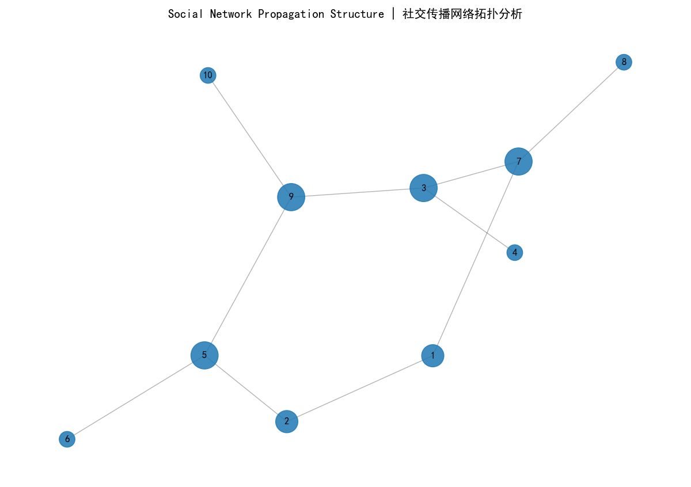

# Social Network Propagation Analysis
## 项目简介 Project Introduction
借助Python搭建简易社交网络分析工具，模拟线上社群用户互动关系，利用基础图论指标分析节点影响力，实现社交网络结构可视化。
项目使用模拟社交媒体互动数据集，通过中心性指标定位社群内关键节点，直观呈现信息传播的网络结构。

This project develops a simple social network analysis tool with Python. It simulates interactions among users in online communities, adopts fundamental graph theory metrics to evaluate node influence, and visualizes the structure of social connections.
With simulated social media interaction data, the system calculates centrality metrics to detect vital community nodes and demonstrates the network structure of information dissemination.

## Preview 项目预览

## 技术栈 Tech Stack
中文：Python, NetworkX, Pandas, Matplotlib
English: Python, NetworkX, Pandas, Matplotlib

## 分析内容 Analysis Content
中文：
1. 搭建社交用户关联网络图
2. 计算度中心性，挖掘社群内具备影响力的用户
3. 可视化网络拓扑结构
4. 分析社群结构与信息传播特征

English:
1. Build graph structures to represent connections between social media users
2. Compute degree centrality to discover influential users within communities
3. Visualize network topology
4. Analyze community structure and characteristics of information spread

## 运行方式 How to Run
中文：
1. 终端安装所需依赖包
